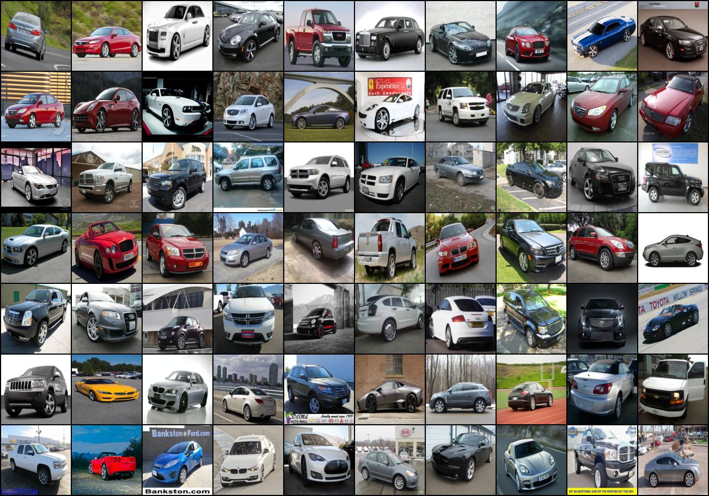
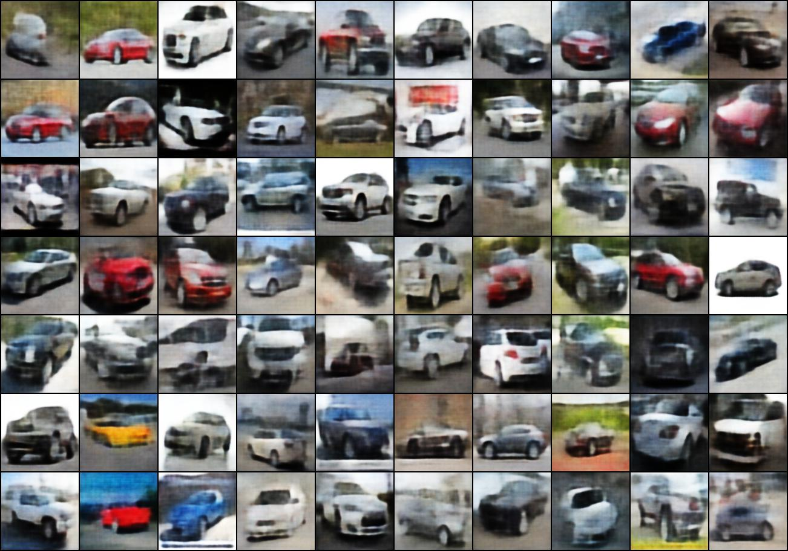

# Variational Autoencoder
This is the code for implementation of variational autoencoder using pytorch, trained over Stanford Cars Dataset (https://ai.stanford.edu/~jkrause/cars/car_dataset.html).

## Usage
Run the following command
```python vae.py```

### Parameters
```--batch-size``` - input batch size for training (default: 64)
```--epochs``` - number of epochs to train (default: 50)
```--lr``` - learning rate step size (default: 10)
```--gamma``` - learning rate step gamma (default: 0.5)
```--seed``` - random seed (default: 1)
```--no-cuda``` - disables CUDA training
```--save-mode``` - for saving the current model

## Results 

Original Images


Reconstructed Images

